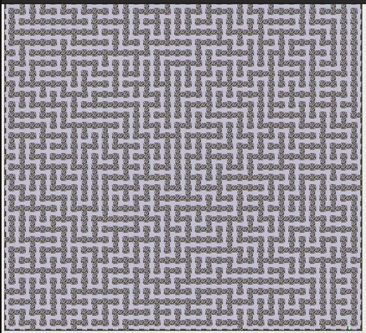

# Maze Generator and Solver

## The assignment - Maze Solver

The Maze solver is my favorite assignment from my undergrad so far. After I completed it, I decided I wanted to code a maze generator and that led me to a deep dive into mazes, graph theory, and time complexity which was really interesting. In the original project, the professor provided code to animate a maze, and mazes in text format, that looked something like this.

scocococococowococo\
wwwwcwwwwwwwcwwwcwc\
ococowococowococowo\
wwwwwwcwwwcwwwwwwwc\
ococowowococococowo\
cwcwwwcwcwwwcwwwwwx

Where s is the start, x is the exit, o is a room, c is a corridor connecting rooms and w is a wall. We had to build a graph that could represent this maze and use a recursive backtracking algorithm to find the exit. I decided to represent the maze using an adjacency list where each room became a node, which stored a list of all the other nodes that are connected to it by a corridor. 

When the project was done the outcome looked something like this.

## The spin-off side project - Random Maze Generator

After I finished the assignment, I wanted to try my algorithm on larger mazes to see how efficient it was. The largest mazes provided by the professor was 50 x 50, which was solved instantly. At first I tried typing one by hand but that proved far too tedious. After a bit of research I learned that one can make a maze with the same backtracking algorithm that I used to solve it. That fascinated me and I had to give it a try.

What I did was I started the algorithm on a fully connected graph, that is, a matrix in which every node has an edge with every adjacent node. The  backtracking algorithm was altered so that the base case would terminate the algorithm when I had visited every node. When solving the maze it was set to terminate when I found the exit. This worked well and when it terminated, I was left with a stack of connecting edges which, when represented as a path, would create a maze in which there is only one solution. 

The only problem left was to turn this abstract list of edges into a text file. I had already written code to the opposite so all that took was a bit of tinkering and frustration and it worked. When I was finally done, I produced some much larger mazes that, when solved, made some very cool looking fractal-like patterns like this.

## What I learned

When I started to generate mazes, I began to realize it takes exponentially more time to generate a maze than to solve it. I thought this was strange as I was using the same algorithm for both. Unable to find a bug in my code that would explain the massive difference, I booked office hours with my professor to ask him about it. He explained to me that the difference was related to the P vs NP problem. He explained that within the set of problem classes, there are some problem classes in which it is computationally expensive to solve them, but very cheap to verify a proposed solution. He said if you think of generating a maze as a problem, then solving that maze is simply checking an answer to that problem. This relationship is similar to the way RSA encryption works. When you connect with another computer using RSA encryption, you and the other computer have retained pieces of information that change decrypting the message from a problem that has to be solved, which would be non-deterministic, to problem whose complexity is more similar to verifying an answer than solving for one, which is a problem in polynomial time. With the base case I used in my  generation algorithm, the difference between solving and generating resembles this class of problems, though it may not fit in the class exactly. 

I have since come to realize that my method for generating mazes is far from the most efficient but, I really enjoyed the process of making the generator and learning what I did along the way. I find that type of learning, where one follows their curiosity and explores, recognizes some mysterious pattern in their exploration, and afterward is taught what that pattern was and how it works, a beautiful way to learn. 

# How to run it

## Maze Solver

With MazeSolver as your current directory, first run **javac Solve.java** to compile the code. Then after that you can run **java Solve ../Mazes/mazeNameHere.txt**. The mazes are stored in /Mazes directory outside of the MazeSolver directory. 

Note that for some larger mazes you may need to increase the stack size to prevent a stack overflow. Do that with the argument **-Xss1g** added directly after java. This makes the stack 1 GB, which is overkill, but it always works. 

Also note that the default cell sizing for the generated mazes is set very small so that the maze can fit of the screen. If you make a small maze, less that 300x300, and solve it, the window may appear extremely small. You can change this by going into the text file and changing the very first line. It contains a number that dictates the cell size. Play around with the numbers but 20 - 50 is good for smaller mazes.

## Maze Generator

With MazeGenerator as the current directory run **javac MazeGenerator.java** to compile the code. Then run **java MazeGenerator n**  , where n is the dimension of the square maze. Again, when generating large mazes you will need to increase the stack with the argument **-Xss1g**.
